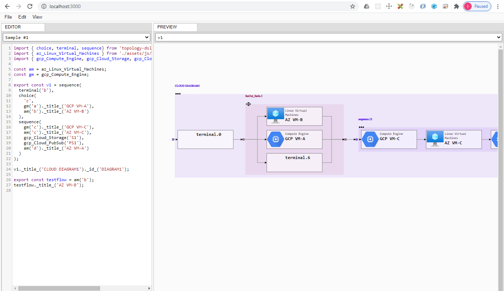

# lerna-preview-kyrcoh

[Open in CodeSandBox](https://codesandbox.io/s/github/imaguiraga/lerna-preview-kyrcoh/tree/master)

[](https://gitpod.io/#https://github.com/imaguiraga/lerna-preview-kyrcoh/tree/master)

# topology-dsl-preview
[Open in CodeSandBox](https://codesandbox.io/s/github/imaguiraga/lerna-preview-kyrcoh/tree/master/packages/topology-dsl-preview)

[](https://gitpod.io/#https://github.com/imaguiraga/lerna-preview-kyrcoh/tree/master/packages/topology-dsl-preview)

A Topology DSL viewer.

[https://www.eclipse.org/elk/reference/options/org-eclipse-elk-layered-nodeplacement-strategy.html](https://www.eclipse.org/elk/reference/options/org-eclipse-elk-layered-nodeplacement-strategy.html)
## PREVIEW
```bash
yarn
cd packages/topology-dsl-preview
yarn start
```
Open url `http://localhost:3000/`

- Sample dsl
```javascript
import { choice, terminal, sequence} from 'topology-dsl';
import { az_Linux_Virtual_Machines } from './assets/js/Azure_Products_Icons/index.js';
import { gcp_Compute_Engine, gcp_Cloud_Storage, gcp_Cloud_PubSub } from 'gcp-dsl';

const am = az_Linux_Virtual_Machines;
const gm = gcp_Compute_Engine;

export const v1 = sequence(
  terminal('b'), 
  choice(
    'c',
    gm('a')._title_('GCP VM-A'),
    am('b')._title_('AZ VM-B')
  ),
  sequence(
    gm('c')._title_('GCP VM-C'),
    am('c')._title_('AZ VM-C'),
    gcp_Cloud_Storage('S1'),
    gcp_Cloud_PubSub('PS1'),
    am('d')._title_('AZ VM-A')
  )
);

v1._title_('CLOUD DIAGRAM1')._id_('DIAGRAM1');

export const testflow = am('b');
testflow._title_('AZ VM-B');
```




## Flow elements ##
- sequence(array)
```javascript
  sequence('a', 'b', 
    repeat(optional('c')), 
    zeroOrMore('d')
  )
```  

- choice(array)
```javascript
  choice(
    terminal('a'),
    choice('e', 'd')
  )
```  

- optional(flowElement)
```javascript
  optional('c')
```  

- repeat(flowElement)
```javascript
  repeat(optional('c'))
```  

- terminal(string)
  ```javascript
  terminal('b')
  ```

- zeroOrMore(flowElement)
  ```javascript
  zeroOrMore('d')
  ```
yarn build && surge --domain imaguiraga-topology-dsl.surge.sh ./build